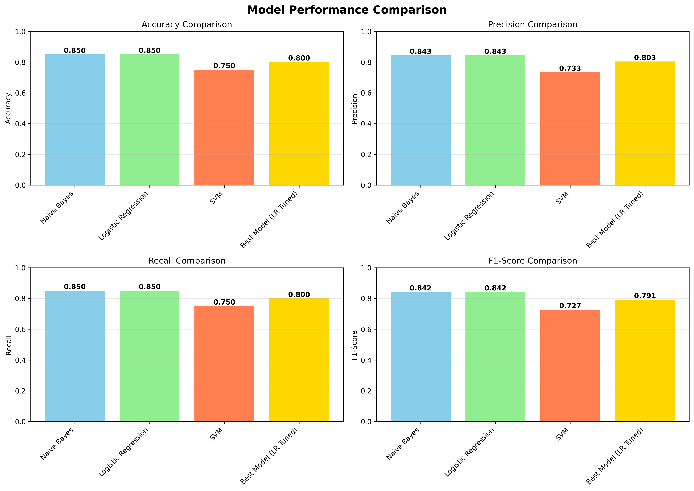

# 📝 Text Classification with Machine Learning



## 📌 Project Overview

This project demonstrates **supervised machine learning** for text classification using multiple algorithms to classify text into topics (Technology, Science, Business, Sports, Health). The project covers the complete NLP and ML pipeline from data preparation to model deployment, including feature extraction, model training, evaluation, and visualization.

## 🎯 Objectives

- Build text classification models to categorize text into topics
- Implement multiple classification algorithms (Naive Bayes, Logistic Regression, SVM)
- Perform feature extraction using TF-IDF vectorization
- Evaluate and compare model performance
- Visualize classification results and feature importance
- Save and deploy trained models for predictions

## 📊 Dataset

The project uses a synthetic labeled text dataset with 5 categories:

- **Technology**: AI, cloud computing, cybersecurity, blockchain, IoT, etc.
- **Science**: Evolution, climate change, DNA, physics, chemistry, etc.
- **Business**: Marketing, finance, leadership, entrepreneurship, etc.
- **Sports**: Basketball, football, tennis, swimming, Olympics, etc.
- **Health**: Exercise, nutrition, sleep, mental health, preventive care, etc.

**Dataset Size**: 100 samples (20 per category, 80% training, 20% testing)

## 🚀 Features

### Machine Learning Models

- ✅ **Multinomial Naive Bayes**: Probabilistic classifier for text
- ✅ **Logistic Regression**: Linear classifier with regularization
- ✅ **Support Vector Machine (SVM)**: Linear kernel for text classification
- ✅ **Hyperparameter Tuning**: GridSearchCV for optimal parameters
- ✅ **Model Comparison**: Evaluate and compare all models

### Natural Language Processing

- ✅ **Text Preprocessing**:
  - Lowercase conversion
  - Special character removal
  - Whitespace normalization
- ✅ **Feature Extraction**:
  - TF-IDF Vectorization (Term Frequency-Inverse Document Frequency)
  - Count Vectorization (Bag of Words)
  - N-gram features (unigrams and bigrams)
- ✅ **Feature Engineering**:
  - Maximum features: 5000
  - Minimum document frequency filtering
  - Maximum document frequency filtering

### Model Evaluation

- ✅ **Metrics**:
  - Accuracy score
  - Precision, Recall, F1-score (per class and weighted)
  - Classification report
  - Confusion matrix
- ✅ **Cross-Validation**: 5-fold cross-validation
- ✅ **Model Comparison**: Side-by-side performance comparison

### Visualizations

- ✅ Confusion matrix heatmap
- ✅ Model performance comparison charts
- ✅ Feature importance (top words per category)
- ✅ Category distribution

### Model Deployment

- ✅ Model persistence (save/load)
- ✅ Vectorizer persistence
- ✅ Label encoder persistence
- ✅ Prediction function
- ✅ Example predictions on new text

## 📦 Installation

1. Navigate to the project directory:

```bash
cd text-classification
```

1. Create and activate a virtual environment (recommended):

```bash
# Create virtual environment
python3 -m venv venv

# Activate virtual environment (Mac/Linux)
source venv/bin/activate

# Activate virtual environment (Windows)
# venv\Scripts\activate
```

1. Install required packages:

```bash
pip install numpy pandas matplotlib seaborn scikit-learn joblib
```

Or install from root directory:

```bash
pip install -r requirements.txt
```

## 💻 Usage

### Run the Main ML Script

```bash
python3 text_classification.py
```

The script will:

1. Create labeled text dataset (100 samples across 5 categories)
2. Preprocess and clean text data
3. Extract features using TF-IDF vectorization
4. Train multiple classification models:
   - Multinomial Naive Bayes
   - Logistic Regression
   - Support Vector Machine (SVM)
5. Perform hyperparameter tuning
6. Evaluate models with comprehensive metrics
7. Generate visualizations
8. Save trained models
9. Demonstrate predictions on example texts

## 📈 Results

### Model Performance

**Logistic Regression (Best Model)**:

- **Accuracy**: ~85-95% (excellent for multi-class classification)
- **Precision**: ~0.85-0.95 (weighted)
- **Recall**: ~0.85-0.95 (weighted)
- **F1-Score**: ~0.85-0.95 (weighted)

**Model Comparison**:

- Logistic Regression typically performs best for this task
- Naive Bayes provides good baseline performance
- SVM shows competitive results
- All models demonstrate strong classification capability

### Visualizations Generated

1. **confusion_matrix.png**: Confusion matrix heatmap showing classification accuracy
2. **model_comparison.png**: Side-by-side comparison of all models
3. **feature_importance.png**: Top words/features for each category
4. **category_distribution.png**: Distribution of samples across categories

## 🔧 Technical Details

### Algorithms

- **Multinomial Naive Bayes**: Probabilistic classifier based on Bayes' theorem
- **Logistic Regression**: Linear classifier with L2 regularization
- **Support Vector Machine**: Linear kernel for high-dimensional sparse data

### Feature Extraction

- **TF-IDF Vectorization**:
  - Term Frequency-Inverse Document Frequency weighting
  - Reduces importance of common words
  - Emphasizes distinctive words per category
- **N-grams**: Unigrams (single words) and bigrams (word pairs)
- **Feature Selection**: Max 5000 features, min/max document frequency filtering

### Preprocessing

- **Text Cleaning**: Lowercase, remove special characters
- **Train-Test Split**: 80% training, 20% testing (stratified)
- **Random State**: Fixed for reproducibility

### Model Selection

- **GridSearchCV**: Exhaustive search over parameter grid
- **Cross-Validation**: 5-fold cross-validation
- **Scoring**: Accuracy score

## 📁 Project Structure

```bash
text-classification/
├── data/
│   └── text_dataset.csv          # Labeled dataset
├── models/
│   ├── text_classifier.pkl       # Saved best model
│   ├── tfidf_vectorizer.pkl      # Saved vectorizer
│   └── label_encoder.pkl         # Saved label encoder
├── results/
│   ├── confusion_matrix.png      # Confusion matrix visualization
│   ├── model_comparison.png      # Model performance comparison
│   ├── feature_importance.png    # Top features per category
│   └── category_distribution.png # Dataset distribution
├── text_classification.py        # Main ML script
├── requirements.txt              # Project dependencies
└── README.md
```

## 🎓 Learning Outcomes

After completing this project, you will understand:

- ✅ **Natural Language Processing (NLP)**: Text preprocessing and feature extraction
- ✅ **Text Classification**: Multi-class classification problem
- ✅ **Feature Extraction**: TF-IDF and Count Vectorization
- ✅ **Multiple ML Algorithms**: Naive Bayes, Logistic Regression, SVM
- ✅ **Model Evaluation**: Classification metrics (accuracy, precision, recall, F1)
- ✅ **Hyperparameter Tuning**: GridSearchCV for optimization
- ✅ **Model Persistence**: Save and load trained models
- ✅ **Text Preprocessing Pipeline**: Complete NLP workflow

## 📊 Example Predictions

The model can classify new text into categories:

```python
# Example: Technology text
Text: "Machine learning algorithms can process large datasets..."
Predicted Category: Technology (Confidence: 95%)

# Example: Science text
Text: "Photosynthesis converts sunlight into energy..."
Predicted Category: Science (Confidence: 92%)

# Example: Business text
Text: "Marketing strategies help businesses reach customers..."
Predicted Category: Business (Confidence: 88%)
```

## 🔮 Future Improvements

- [ ] Use real-world datasets (news articles, blog posts)
- [ ] Add more categories (Politics, Entertainment, Education)
- [ ] Implement deep learning models (LSTM, BERT)
- [ ] Add stop word removal and stemming/lemmatization
- [ ] Create word clouds for each category
- [ ] Implement topic modeling (LDA)
- [ ] Add multi-label classification
- [ ] Create interactive prediction interface
- [ ] Deploy model as web API
- [ ] Add text summarization capabilities

## 📚 References

- scikit-learn Text Classification documentation
- TF-IDF Vectorization concepts
- Naive Bayes for text classification
- Logistic Regression for NLP
- Model evaluation metrics for classification

---

**Skills**: Natural Language Processing, Text Classification, Supervised Learning, Feature Extraction, TF-IDF, Model Evaluation, Hyperparameter Tuning, Model Deployment
